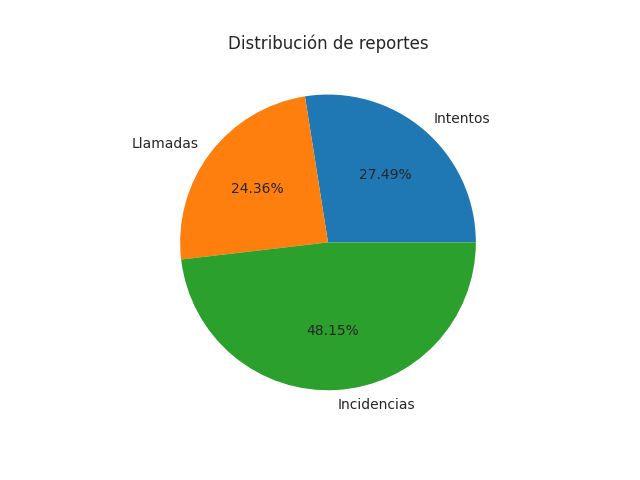
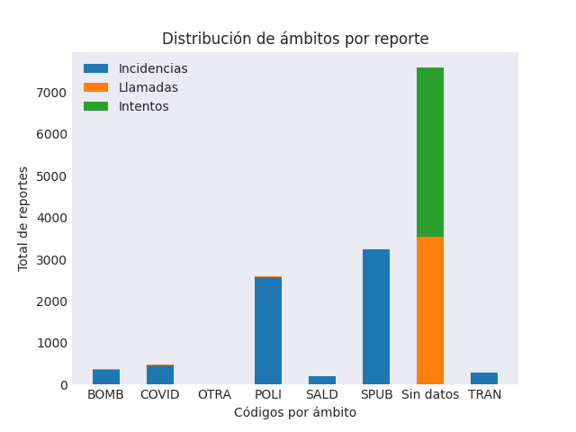
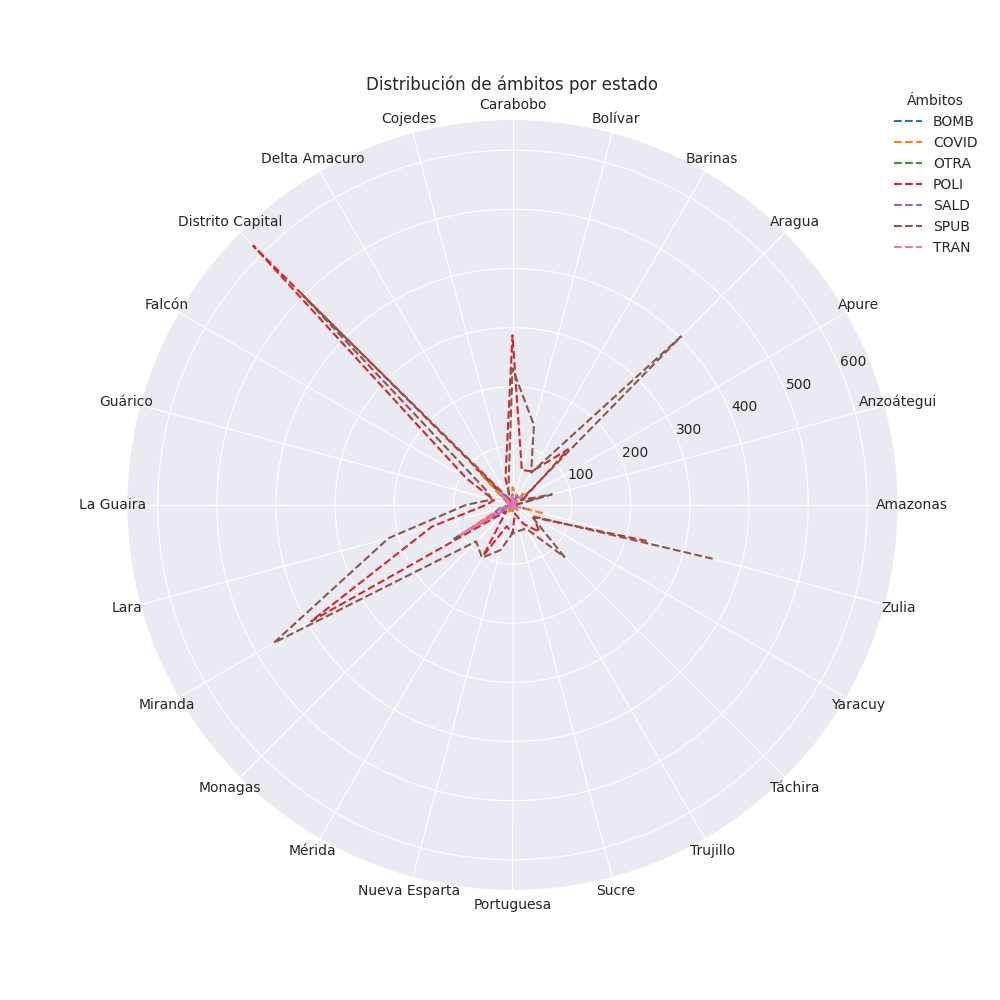

# estadistica_python

Proyecto de prueba usando python y las libreras básicas de estadística.

## Requerimientos

* [Python](https://www.python.org/)
* [Numpy](https://numpy.org/)
* [Pandas](https://pandas.pydata.org/)
* [Matplotlib](https://matplotlib.org/)

## Origen de datos

La información suministrada pertenece a una aplicación de envío de reportes de alta prioridad en Venezuela, a ser atendidos por las entidades pertinentes.
Dicha información proviene de una base de datos privada, por lo que se incluyen los archivos `incidencias.csv` y `llamadas.csv`, los cuales poseen los reportes enviados por medio de formularios y llamadas (o intentos) realizadas, respectivamente.

### Columnas disponibles

* id: Identificador del reporte.
* fecha: Fecha en que el reporte fue generado.
* ambito: Nombre de la clasifación principal del reporte (servicios públicos, COVID19, seguridad ciudadana, gestión de riesgos, etc).
* codigo: Código en representación del ámbito.
* clasificacion: Nombre de la clasificación secundaria del reporte (Ej: para gestión de riesgos, se incluyen derrumbes, inundaciones, etc).
* id_clasificacion: Identificador único de la clasificación.
* id_estado: Identificador del estado.
* estado: Nombre de la primera división político territorial.
* id_municipio: Identificador del municipio.
* municipio: Nombre de la segunda división político territorial.
* id_parroquia: Identificador de la parroquia.
* parroquia: Nombre de la tercera división político territorial.
* id_cuadrante: Identificador del cuadrante.
* cuadrante: Nombre de la cuarta división político territorial.
* tipo: Indica si el reporte fue intento de llamada (sólo en las llamadas).

### Datos adicionales

* Todos los reportes fueron generados entre inicios de febrero y finales de julio del año 2021.
* Todas las incidencias pertenecen a un ámbito y, por lo tanto, tienen una clasificación. Los intentos de llamada nunca tienen ámbito.
* Es posible que algunos municipios, parroquias, cuadrantes y clasificaciones tengan nombres repetidos, por lo que se mantienen los identificadores para diferenciarlos.
* Es posible que algunos cuadrantes tengan estado asociado, pero no necesariamente municipio o parroquia.
* Como la información proviene de una aplicación móvil que requiere conexión a Internet, siempre se procura enviar la ubicación del dispositivo en el momento en que se envía un reporte. Con estas coordenadas, se verifica contra las geometrías almacenadas para indicar si corresponde con alguna división político territorial conocida.

## Resultados

En el archivo `calcular.py` se pueden observar las operaciones realizadas, en donde se incluyen las siguientes funciones:

* mean: Recibe un DataFrame y el nombre de una columna en el mismo. Retorna un flotante que representa el promedio de los elementos en dicha columna.
* median: Recibe un DataFrame ordenado por una columna en particular. Retorna la(s) columna(s) en el medio.
* mode: Recibe un DataFrame y el nombre de una columna en el mismo. Retorna el elemento con más repeticiones en dicha columna (de haber más de uno, retorna el primero).
* weighted_median: Recibe un DataFrame y el nombre de una columna de pesos perteneciente al mismo. Retorna el o los valores del centro bajo los pesos indicados.
* weighted_mean: Recibe un DataFrame, el nombre de una columna de interés y el nombre de una columna de pesos asociados. Retorna el promedio de los elementos de la columna seleccionada bajo el efecto de los pesos indicados.

Con esta información, se realizan los siguientes ćalculos:

* Se obtienen los datos de los archivos `incidencias.csv` y `llamadas.csv` en dos DataFrame.
* Se agrega un campo de adicional al DataFrame de incidencias para tener la misma forma que el de llamadas.
* Se modifican los campos `NaN` por un texto alusivo (`Sin datos`) o cero, dependiendo del tipo de cada columna.
* Se concatenan los DataFrames en uno solo y se ordenan por fecha, desde la más vieja hasta la más reciente.
* Se crea un DataFrame aparte para manejar los pesos por ámbitos, donde se le da mayor prioridad a los ámbitos de COVID19, gestión de riesgos y seguridad ciudadana:

```sh
                 index  cantidad  peso
0              COVID19       473     5
1   GESTIÓN DE RIESGOS       372     6
2                 OTRA         7     1
3                SALUD       208     2
4  SEGURIDAD CIUDADANA      2582     5
5   SERVICIOS PÚBLICOS      3242     3
6            Sin datos      7591     1
7   TRÁNSITO TERRESTRE       287     3
```

* Se obtiene la mediana (ordenado por fecha):

```sh
                     fecha               ambito     codigo  id_clasificacion clasificacion  id_estado  ...   municipio  id_parroquia  parroquia  id_cuadrante cuadrante  tipo
3046  2021-05-05 22:12:48  SEGURIDAD CIUDADANA       POLI                74         Hurto         21  ...    Cárdenas           830   Cárdenas           585      P-04     2
11442 2021-05-05 22:12:53            Sin datos  Sin datos                 0     Sin datos          2  ...  Libertador            19  San Pedro          2009      P-01     1
```

* Se obtiene la mediana ponderada con la lista de pesos indicada anteriormente. En este caso, se ordenó por ámbitos por tener menos variedad:

```sh
   index  cantidad  peso
2  OTRA         7     1
```

* La moda por ámbito (y por lo tanto por clasificación) es `Sin datos`, la moda por estado es `Distrito Capital`.
* La media por ámbito es `1845.25`, mientras que la media ponderada (usando el DataFrame de pesos) es aproximadamente `1388.77`.

Como se puede apreciar que hay demasiados ámbitos `Sin datos`, se repiten las operaciones anteriores descartando estos registros:

* La mediana por fecha resulta en un registro de unos días antes al generado anteriormente, mientras que la mediana ponderada no fue afectada:

```sh
                    fecha              ambito codigo  id_clasificacion                       clasificacion  ...  id_parroquia   parroquia  id_cuadrante cuadrante  tipo
3522 2021-04-26 18:18:12  SERVICIOS PÚBLICOS   SPUB                85  Agua Potable/Bote de aguas blancas  ...             9  El Paraíso          1902      P-04     2
```

* La moda por ámbito pasa a ser `SERVICIOS PÚBLICOS`, la de clasificación `Alteración órden público` y el estado se mantiene igual.
* La media por ámbito se aproxima a `1024.43`, mientras que la media ponderada es  `1140.68`.

## Gráficos

1. Distribución de registros

Existen 7108 incidencias, 4058 intentos de llamadas y 3596 llamadas, dando un total de 14762 registros. El siguiente gráfico de pie ilustra esta distribución.



2. Ámbitos por reporte

En la siguiente gráfica de barras apiladas se puede apreciar que la mayoría de las llamadas no poseen ámbito asociado, superando los 7000 registros. El ámbito más cercano a dicha cantidad es el de servicios públicos, con un poco más de 3000 registros. Esto mantiene consistencia con los cálculos de moda realizados anteriormente.



3. Ámbitos por estado

Este reporte muestra la distribución de los ámbitos entre los estados, sin considerar los registros de ámbito vacío para facilitar la lectura. Se puede apreciar que, en la mayoría de los estados, los reportes enviados corresponden a los ámbitos de servicios públicos y seguridad ciudadana. Los estados más afectados son `Distrito Capital`, `Miranda`, `Zulia`, `Aragua` y `Carabobo`.


